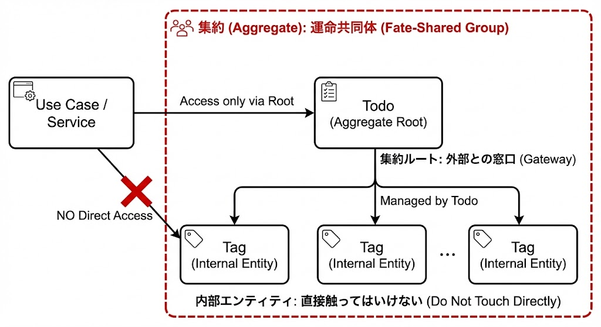

### 1. 概念の定義

#### 集約 (Aggregate) とは？

**「必ず一塊（ひとかたまり）で扱わなければならないデータのグループ」のことです。
これはデータの整合性（Consistency）を保つための境界線**です。

#### 集約ルート (Aggregate Root) とは？

そのグループ（集約）の**代表者**となるエンティティです。
外部（ユースケースや他の集約）は、**必ずこの「ルート」を経由してしか、グループ内部のデータを操作できません。**

---

### 2. 図解：TODOアプリにおける集約


* **境界線（赤枠）:** これが「集約」です。この中身は運命共同体です。
* **Todo:** これが「集約ルート」です。外部との窓口です。
* **Tag:** これは集約の「内部エンティティ」です。外部から直接触ってはいけません。

---

### 3. なぜ「集約」が必要なのか？（ルールとメリット）

もし集約の概念がなく、`Tag` を自由に操作できるとしたらどうなるでしょうか？

**悪い例（集約を無視した操作）：**

> 「Todoの中にあるタグの個数は最大5個まで」というビジネスルールがあったとします。
> もし、開発者が `TagRepository.add(tag)` のように、Todoを通さずに直接TagをDBに追加してしまったら？
> -> **Todo本体はそのことに気づけず、「最大5個」というルールが破られてしまいます。**

これを防ぐための、集約の**3つの鉄則**があります。

#### 鉄則①：ルート以外への直接アクセス禁止

外部のクラス（Serviceなど）は、`Tag` オブジェクトのメソッドを勝手に呼んだり、`Tag` を直接書き換えてはいけません。必ず `Todo` に頼みます。

```typescript
// × 悪い例：外部から直接リストを操作している
const tags = todo.tags;
tags.push(new Tag('new')); // Todoクラスは感知できない！

// ○ 良い例：ルートであるTodoに依頼する
todo.addTag('new'); // Todoクラス内でバリデーション（個数チェックなど）ができる！

```

#### 鉄則②：リポジトリは「集約ルート」単位でしか作らない

これが先ほどのコードで `ITodoRepository` はあっても `ITagRepository` を作らなかった理由です。
Tagが欲しければ、必ずTodoごと取得します。

* ✅ `TodoRepository.save(todo)` （OK: TodoとTagをまとめて保存）
* 🚫 `TagRepository.save(tag)` （NG: Tagだけ単独で保存）

#### 鉄則③：トランザクションの一貫性

集約内の変更は、**「保存するか、失敗するか」のどちらか**でなければなりません。
「Todoのタイトルは変わったけど、Tagの追加は失敗してDBに残らなかった」という中途半端な状態は許されません。

---

### 4. コードで見る「集約ルートの責任」

先ほどの `Todo` クラス（集約ルート）に、メソッドを追加して責任を持たせてみましょう。

**要件：同じラベルのタグは重複して登録できない。**

```typescript
// src/domain/model/todo.ts

export class Todo {
  // ...（プロパティ定義は前回と同じ）

  // 【重要】集約ルートが「整合性」を管理する
  addTag(label: string): void {
    // 1. ルールのチェック（不変条件の維持）
    const isDuplicate = this._tags.some(tag => tag.label === label);
    if (isDuplicate) {
      throw new Error('同じタグは既に追加されています');
    }

    // 2. 状態の変更
    // ID生成などはここでやるか、ファクトリに任せる
    const newTag = new Tag(crypto.randomUUID(), label);
    this._tags.push(newTag);
  }
}

```

このように、ロジックを `Todo` クラス（ルート）に書くことで、**どこから呼ばれてもルールが絶対に守られる**ようになります。これがDDDの強みです。

---

### 5. まとめ

| 用語 | 役割 | TODOアプリでの例 | アナロジー（車） |
| --- | --- | --- | --- |
| **集約** | データの整合性を保つ境界 | Todo全体（Todo + Tag + ID） | 車全体（ボディ + タイヤ + エンジン） |
| **集約ルート** | 操作の窓口となる親玉 | `Todo` クラス | 車体（Car） |
| **内部要素** | ルートに管理される部品 | `Tag` クラス | タイヤ（Tire） |

**タイヤ交換の例え:**
あなたはタイヤ交換をする時、タイヤ自体に「外れろ」とは言いません。「車」を修理工場に持っていき、「車」に対して「タイヤ交換」を依頼します。
これと同じで、**「Tag」を追加したい時は、「Todo」に対して依頼をする**のです。

集約の概念、イメージできましたでしょうか？
もしよろしければ、この概念を使って**「重複タグを許さない `addTag` メソッド」をTDDで実装する**ステップに進んでみますか？

素晴らしいですね！その意欲、最高です。
**「集約ルート（Todo）が、内部の整合性（重複タグ禁止）を責任を持って守る」** というDDDの醍醐味をTDDで実装しましょう。

今回は **ドメイン層の単体テスト (`todo.spec.ts`)** を書いて、エンティティの実装を行います。

---

# Hands-on: 集約のロジック実装

## Step 1: テストを作成する (Red)

まだ `addTag` メソッドは存在しませんが、まずは「こうあるべき」というテストを書きます。
`src/domain/model/todo.spec.ts` というファイルを新規作成してください。

```typescript
// src/domain/model/todo.spec.ts
import { Todo } from './todo';

describe('Todo Entity (Aggregate Root)', () => {
  // テストデータの準備
  const existingId = 'todo-1';
  const existingTitle = 'Test Todo';

  it('新しいタグを正常に追加できること', () => {
    // 1. 初期状態のTodoを作成（タグなし）
    const todo = Todo.reconstruct(existingId, existingTitle, []);

    // 2. addTagを実行
    todo.addTag('New Label');

    // 3. 検証：タグが1つ増えていること
    expect(todo.tags).toHaveLength(1);
    expect(todo.tags[0].label).toBe('New Label');
  });

  it('重複するタグを追加しようとするとエラーになること', () => {
    // 1. 最初から "Urgent" というタグを持っているTodoを作成
    const todo = Todo.reconstruct(existingId, existingTitle, [
      { id: 'tag-1', label: 'Urgent' },
    ]);

    // 2. 同じ "Urgent" を追加しようとしてエラーになるか検証
    expect(() => {
      todo.addTag('Urgent');
    }).toThrow('このタグは既に追加されています');
  });
});

```

この時点でテストを実行すると、`todo.addTag is not a function` で**失敗（Red）**することを確認します。

```bash
npm test
```

---

## Step 2: 実装を作成する (Green)

それでは `Todo` クラスに `addTag` メソッドを追加してテストを通します。
ここでは、以下のビジネスルールを実装します。

1. 現在のタグ一覧をチェックする。
2. 重複があればエラーを投げる（ガード節）。
3. 重複がなければ `Tag` オブジェクトを生成してリストに追加する。

```typescript
// src/domain/model/todo.ts
import { TodoId } from './todo-id';
import { Tag } from './tag';
import { v4 as uuidv4 } from 'uuid'; // ID生成用 (なければ仮の文字列でOK)

export class Todo {
  // ... (コンストラクタやreconstructはそのまま)
  private constructor(
    public readonly id: TodoId,
    public readonly title: string,
    private _tags: Tag[],
  ) {}

  // ... (reconstruct等は省略)

  // 【追加】ドメインロジック
  addTag(label: string): void {
    // 1. バリデーション（不変条件の維持）
    const isDuplicate = this._tags.some((tag) => tag.label === label);
    if (isDuplicate) {
      throw new Error('このタグは既に追加されています');
    }

    // 2. 状態の変更
    // 本来はUUIDなどを生成すべきですが、簡単のためランダム文字列にします
    const newTagId = Math.random().toString(36).substring(7);
    const newTag = new Tag(newTagId, label);

    this._tags.push(newTag);
  }

  get tags(): Tag[] {
    return [...this._tags];
  }
}

```

これでテストを実行してください。

```bash
npm test
```

**テストが全て通れば成功（Green）です！**

---

## Step 3: ユースケースへの組み込み（応用）

せっかくドメインロジックができたので、これを呼び出すアプリケーション層（Use Case）がどうなるか、イメージを掴んでおきましょう。
（コードは書かなくて大丈夫ですが、流れを見てください）

**「タグ追加」のユースケース** は以下のようになります。

```typescript
// イメージ（application/use-case/add-tag.use-case.ts）

async execute(todoId: string, tagLabel: string) {
  // 1. リポジトリから集約ごと取得する
  const todo = await this.todoRepository.findById(todoId);
  if (!todo) throw new Error('Todo not found');

  // 2. 集約ルートのメソッドを呼ぶ（ここで重複チェックが自動で走る！）
  todo.addTag(tagLabel);

  // 3. 変更された集約を保存する
  await this.todoRepository.save(todo);
}

```

### この設計のすごいところ

ユースケース（Application層）は、「重複チェック」という複雑な判定を一切していません。ただ `addTag` を呼んだだけです。

もし将来、「タグは最大5個まで」というルールが増えても、**`Todo` クラスの `addTag` メソッドを1行修正するだけ**で、すべての機能にそのルールが適用されます。
これが「ドメインモデルにロジックを集める（ドメイン駆動）」の強烈なメリットです。

---

### 次のステップ

これで「集約内の整合性を守るロジック」が書けました。
次は、この変更を永続化（保存）するために、**リポジトリに `save` メソッドを追加する** ステップはいかがですか？
それとも、APIとして動かすためにコントローラーを作りますか？

承知しました。「タグは最大5個まで」というルールは、DDDにおける**不変条件（Invariant）**の非常に良い例です。

これをTDDで実装し、その後の設計で気をつけるべきポイントと、よくある間違い（アンチパターン）を解説します。

---

## 1. 【TDD】最大5個ルールの実装

まずテストコードから書きます。境界値分析（5個はOK、6個はNG）を意識します。

### 1-1. テスト作成 (Red)

`src/domain/model/todo.spec.ts` に以下のテストケースを追加します。

```typescript
// src/domain/model/todo.spec.ts

  // ... (前回のテストの続き)

  it('タグが既に5個ある場合、追加しようとするとエラーになること', () => {
    // 準備: 既に5個のタグがあるTodoを作成
    const todo = Todo.reconstruct('id-1', 'Title', [
      { id: '1', label: 'Tag1' },
      { id: '2', label: 'Tag2' },
      { id: '3', label: 'Tag3' },
      { id: '4', label: 'Tag4' },
      { id: '5', label: 'Tag5' },
    ]);

    // 検証
    expect(() => {
      todo.addTag('Tag6');
    }).toThrow('タグは最大5個までです');
  });

```

### 1-2. 実装 (Green)

`Todo` エンティティの `addTag` メソッドにチェック処理を追加します。

```typescript
// src/domain/model/todo.ts

  addTag(label: string): void {
    // 1. 重複チェック（既存）
    if (this._tags.some((tag) => tag.label === label)) {
      throw new Error('このタグは既に追加されています');
    }

    // 2. 【追加】個数制限チェック（不変条件）
    if (this._tags.length >= 5) {
      throw new Error('タグは最大5個までです'); // ドメイン例外
    }

    const newTagId = Math.random().toString(36).substring(7);
    const newTag = new Tag(newTagId, label);
    this._tags.push(newTag);
  }

```

これで `npm test` が通るはずです。これがドメインロジックの実装です。

---

## 2. 実装後の「適切な詳細設計」のポイント

ビジネスロジックを書いた後、それをシステム全体でどう扱うか。ここが設計の腕の見せ所です。

### ポイント①：ドメイン固有例外（Domain Exception）を作る

現在は `new Error('メッセージ')` としていますが、これはあまり良くありません。なぜなら、呼び出し元（Controllerなど）が「システムエラー」なのか「ビジネスルール違反」なのか区別しにくいからです。

**改善案:**

```typescript
// src/domain/exception/max-tags-limit-exceeded.exception.ts
export class MaxTagsLimitExceededException extends Error {
  constructor() {
    super('タグは最大5個までです');
    this.name = 'MaxTagsLimitExceededException';
  }
}

```

こうしておくと、Controller層で以下のようにきれいにハンドリングできます。

```typescript
// catchブロックやExceptionFilterでの処理
if (error instanceof MaxTagsLimitExceededException) {
  // 422 Unprocessable Entity や 400 Bad Request を返す
  return response.status(422).json({ message: error.message });
}

```

### ポイント②：楽観的ロック（Optimistic Locking）

「最大5個」のようなルールは、**同時アクセス**で破られるリスクがあります。

* Aさんがタグを追加（現在4個→取得→チェックOK）
* 同時にBさんがタグを追加（現在4個→取得→チェックOK）
* Aさんが保存（5個になる）
* Bさんが保存（6個になってしまう！）

これを防ぐために、`Todo` エンティティに `version` プロパティを持たせ、保存時にバージョンチェックを行う（DB更新時に `WHERE version = readVersion` とする）のが、堅牢なシステムの定石です。

---

## 3. アンチパターン（やってはいけないこと）

DDDや集約の概念を導入した際、よくやってしまう間違いを紹介します。

### 🚫 アンチパターン1：ドメインモデル貧血症 (Anemic Domain Model)

ルールをEntityではなく、UseCase（Service）に書いてしまうこと。

```typescript
// 悪い例：UseCase (Service)
async execute(todoId, label) {
  const todo = await repo.findById(todoId);

  // × ここにロジックを書いちゃダメ！
  if (todo.tags.length >= 5) {
     throw new Error('5個までだよ');
  }

  todo.tags.push(new Tag(label)); // 直接操作もダメ
  await repo.save(todo);
}

```

**なぜダメか？**
もし他の場所（例：CSVインポート機能）でタグを追加する処理を作った時、そこに同じチェックコードをコピペし忘れたら、ルールが破綻するからです。ロジックはEntityに閉じ込めるのが正解です。

### 🚫 アンチパターン2：直接インサート (Bypassing Aggregate)

「Tagを追加するだけだから、Todo全体を取得するのは重いな…」と考え、Tagテーブルに直接INSERTすること。

```sql
-- 悪い例：集約ルート(Todo)を無視して、直接Tagテーブルに入れる
INSERT INTO tags (todo_id, label) VALUES ('1', 'NewTag');

```

**なぜダメか？**
これをやると、DBレベルではインサートできますが、アプリケーション上の「最大5個」「重複禁止」というルールが**完全に無視**されます。
集約ルート（Todo）を経由しない更新は、整合性破壊の第一歩です。

### 🚫 アンチパターン3：フロントエンドのみのバリデーション

画面（React/Vueなど）で「5個以上追加ボタンを押せなくする」だけで対応し、API側のチェックをサボること。

**なぜダメか？**
APIをcurlやPostmanで直接叩かれたら、無限にタグを追加できてしまいます。フロントエンドの制限はあくまでUXのためであり、ビジネスルールの最後の砦は必ずドメイン層（バックエンド）が守らなければなりません。

---

## 次のステップの提案

詳細設計のポイントとして挙げた **「ドメイン固有例外」** を実際に導入してみませんか？
NestJSには `ExceptionFilter` という機能があり、ドメイン例外をHTTPステータスコードに変換する仕組みをきれいに作ることができます。

「ExceptionFilterの実装を見たい」や、「楽観的ロックについて詳しく」など、気になる方向性はありますか？


NestJSの `ExceptionFilter` を使って、ドメイン層で発生した純粋なTypeScriptの例外（Domain Exception）を、HTTPの作法（400番台のエラーレスポンス）にきれいに変換する実装を行いましょう。

これにより、**「ドメイン層はHTTPのことを何も知らなくて良い（依存しない）」** というクリーンアーキテクチャの原則を守りながら、クライアントには親切なエラーを返すことができます。

---

# Hands-on: Exception Filter の実装

## Step 1: ドメイン例外の定義

まずは、ドメイン層で投げるための専用例外クラスを作ります。
汎用性を持たせるため、基底クラス `DomainException` を作っておくと便利です。

```typescript
// src/domain/exception/domain.exception.ts
export abstract class DomainException extends Error {
  constructor(message: string) {
    super(message);
    this.name = 'DomainException';
  }
}

```

次に、具体的なビジネスルールの例外を作ります。

```typescript
// src/domain/exception/max-tags-limit-exceeded.exception.ts
import { DomainException } from './domain.exception';

export class MaxTagsLimitExceededException extends DomainException {
  constructor() {
    super('タグは最大5個までです。これ以上追加できません。');
  }
}

```

※ ドメイン層のコード (`Todo.ts` など) で `throw new Error(...)` していた箇所を、`throw new MaxTagsLimitExceededException()` に書き換えておいてください。

---

## Step 2: Exception Filter の実装 (Adapter)

このフィルタが **「ドメインの言葉」を「Webの言葉」に翻訳** します。インフラ層（またはインターフェース層）に配置します。

```typescript
// src/infrastructure/filter/domain-exception.filter.ts
import { ExceptionFilter, Catch, ArgumentsHost, HttpStatus } from '@nestjs/common';
import { Response } from 'express';
import { DomainException } from '../../domain/exception/domain.exception';
import { MaxTagsLimitExceededException } from '../../domain/exception/max-tags-limit-exceeded.exception';

// DomainException を継承したクラスすべてをキャッチする
@Catch(DomainException)
export class DomainExceptionFilter implements ExceptionFilter {
  catch(exception: DomainException, host: ArgumentsHost) {
    const ctx = host.switchToHttp();
    const response = ctx.getResponse<Response>();

    // デフォルトは 400 Bad Request とする
    let status = HttpStatus.BAD_REQUEST;

    // 例外の種類によってステータスコードを使い分ける分岐
    if (exception instanceof MaxTagsLimitExceededException) {
      // ルール違反なので 422 Unprocessable Entity が意味的に適切
      status = HttpStatus.UNPROCESSABLE_ENTITY;
    }

    // クライアントに返すJSON構造を定義
    response
      .status(status)
      .json({
        statusCode: status,
        error: exception.name,       // 例: MaxTagsLimitExceededException
        message: exception.message,  // 例: タグは最大5個までです...
        timestamp: new Date().toISOString(),
      });
  }
}

```

---

## Step 3: アプリ全体への適用

作成したフィルタをアプリケーションに登録します。`main.ts` でグローバル設定するのが一番簡単です。

```typescript
// src/main.ts
import { NestFactory } from '@nestjs/core';
import { AppModule } from './app.module';
import { DomainExceptionFilter } from './infrastructure/filter/domain-exception.filter';

async function bootstrap() {
  const app = await NestFactory.create(AppModule);

  // 【追加】ここでフィルタをグローバル登録
  app.useGlobalFilters(new DomainExceptionFilter());

  await app.listen(3000);
}
bootstrap();

```

---

## Step 4: 動作確認

これで準備完了です。実際にタグを6個以上追加するようなAPIリクエストを送ると、サーバーがクラッシュすることなく（500エラーにならず）、以下のようなきれいなJSONが返ってきます。

**レスポンス例 (HTTP 422):**

```json
{
  "statusCode": 422,
  "error": "MaxTagsLimitExceededException",
  "message": "タグは最大5個までです。これ以上追加できません。",
  "timestamp": "2024-01-01T12:00:00.000Z"
}

```

---

## 設計のポイント：なぜこれが優れているのか？

1. **関心の分離**:
* `Todo.ts` (ドメイン) は「HTTPステータスコードが400か422か」なんて知りません。ただ「ルール違反だ！」と叫ぶ（throwする）だけです。
* `DomainExceptionFilter` (インフラ) が「その違反ならWebでは422と表現しよう」と翻訳します。
* これにより、将来Web以外のインターフェース（CLIやgRPCなど）が増えてもドメインロジックは一切変更不要です。


2. **コントローラーが汚れない**:
* コントローラー内で `try-catch` を書く必要がなくなります。コントローラーは正常系の処理だけを書けば良く、コードの見通しが劇的に良くなります。


### 応用: 重複エラーなども対応する場合

`Todo.ts` で重複エラー発生時に投げる `DuplicateTagException` などを作った場合も、この Filter の `if` 文に追加するか、マップ（辞書）を使ってマッピング定義を追加するだけで対応できます。

```typescript
// マッピングの例（switch文の代わり）
const errorMapping: Record<string, HttpStatus> = {
  MaxTagsLimitExceededException: HttpStatus.UNPROCESSABLE_ENTITY,
  DuplicateTagException: HttpStatus.CONFLICT, // 409 Conflict
  TodoNotFoundException: HttpStatus.NOT_FOUND, // 404 Not Found
};

```

このように拡張していくのがおすすめです。

結論から言うと、**「単純な値の変換（1対1の対応）」であれば、マッピング（オブジェクト/Map）の方が圧倒的に優れています。**

しかし、**「条件によって処理内容が複雑に分岐する場合」は `switch` や `if` の方が適しています。**

なぜ今回のExceptionFilterの例でマッピングを推奨したのか、その理由と使い分けの基準を解説します。

---

### 1. 比較：Switch vs マッピング

「エラー名」を「HTTPステータス」に変換する処理で比較してみましょう。

#### A. `switch` 文を使う場合（命令的）

「もし〜なら〜せよ」という**手続き**を書くスタイルです。

```typescript
// 行数が多く、視線が上下に移動する（可読性が低い）
function getStatus(exceptionName: string): number {
  switch (exceptionName) {
    case 'MaxTagsLimitExceededException':
      return 422;
    case 'DuplicateTagException':
      return 409;
    case 'TodoNotFoundException':
      return 404;
    default:
      return 400;
  }
}

```

#### B. マッピングを使う場合（宣言的）

「AはBである」という**データ（定義）**を書くスタイルです。

```typescript
// 定義とロジックが分離され、スッキリする
const statusMap: Record<string, number> = {
  MaxTagsLimitExceededException: 422,
  DuplicateTagException: 409,
  TodoNotFoundException: 404,
};

// ロジックはたった1行
const status = statusMap[exceptionName] || 400;

```

---

### 2. マッピングが良い理由（メリット）

今回のようなケースでマッピングを使うメリットは主に3つあります。

#### ① OCP（開放閉鎖の原則）を守りやすい

新しい例外を追加したい時、

* `switch` の場合：`getStatus` という**関数（ロジック）の中身を書き換える**必要があります。誤って他の `case` を消してしまうリスクがあります。
* `mapping` の場合：`statusMap` という**辞書（設定）に行を追加するだけ**です。ロジック（`statusMap[key]`）には触れる必要がありません。

#### ② 循環的複雑度（Cyclomatic Complexity）が下がる

`if` や `switch` が増えると、コードの複雑度（テストの分岐ルートの数）が上がります。マッピングは分岐としてカウントされないため、コードがフラットでシンプルに保たれます。

#### ③ 高速（O(1)）

`if` 文は上から順番に評価していくため、条件が多いと計算量は O(n) になります。マッピング（ハッシュマップ）は一発で値を取りに行けるため、数が100個あっても計算量は O(1) です。（※現代のJSエンジンではswitchも最適化されるので、微々たる差ですが）

---

### 3. マッピングではダメな場合（Switch/Ifの出番）

逆に、以下のような場合は `switch` や `if` を使うべきです。

#### ケース①：条件が複雑な場合

「値が一致するか」ではなく、「範囲」や「複数の条件」がある場合。

```typescript
// マッピングでは表現しにくい
if (age > 20 && hasTicket) { ... }
else if (score >= 80) { ... }

```

#### ケース②：副作用（処理）が必要な場合

単に値を返すだけでなく、それぞれ全く違う関数を実行したい場合。
（※これも関数をマッピングすれば可能ですが、可読性が下がる場合があります）

```typescript
switch (action) {
  case 'create':
    await this.service.create(); // DBに書き込む
    this.logger.log('Created');  // ログを吐く
    break;
  // ...
}

```

#### ケース③：TypeScriptの型推論（網羅性チェック）を使いたい場合

`switch` 文の場合、Union型と組み合わせると「全てのパターンを網羅していないとコンパイルエラーにする」という強力な機能が使えます。

```typescript
type Color = 'Red' | 'Blue';

function getColorCode(c: Color) {
  switch (c) {
    case 'Red': return '#f00';
    // 'Blue' が抜けているとTSが警告を出してくれる（設定による）
  }
}

```

---

### 4. まとめ：使い分けのルール

今回のExceptionFilterの例で言うと、**「例外クラス名」と「ステータスコード」の関係は静的な 1対1 の関係（変換テーブル）** なので、マッピングが最適解でした。

| 状況 | 推奨 | 理由 |
| --- | --- | --- |
| **A は B である (変換)** | **マッピング** | データ定義として扱える。拡張が楽。 |
| **A なら 関数B を実行する (分岐)** | **Switch / If** | 処理の流れが見えやすい。 |
| **条件が複雑 (範囲、AND/OR)** | **If** | 柔軟に書ける。 |

**「ロジック（処理の流れ）」を書いているのか、「設定（対応表）」を書いているのか**を意識すると、どちらを使うべきか自然と決まりますよ。

次のステップとして、このExceptionFilterを使って、実際にバリデーションエラーなどをハンドリングしてみましょうか？